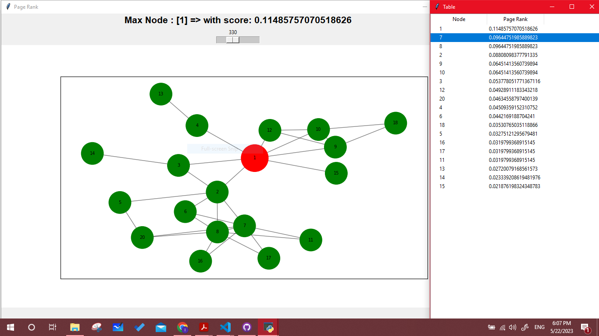

# Mini Social networks analysis tool

It is a desktop software for network analysis and visualization. It is a tool used by data analysts and researchers to explore graphs of different networks. It enables users to interact with the graphs in many ways like coloring and adjusting nodes and edges based on calculated metrics or existing features, filtering the graphs based on any criteria, applying different community detection methods, link prediction techniques, and detecting influential users. Your task is to implement such an interactive system using any programming language you like
(using Python (NetworkX)). It is a GUI desktop application

# 1 => choose cvs files of node & edge then choose type of graph

# 2 => Show Graph

# 3= > community Detection Louvian

# 4 => Page Rank

# 5 => Modularity NMI Condundance

# 6 => Degree Centrality

# 7 => Betweness Centrality

# 8 => Directed Graph

